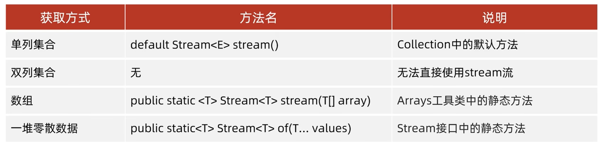
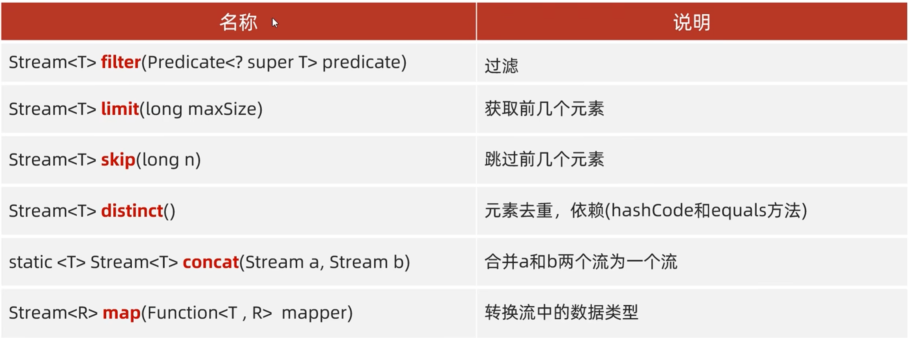
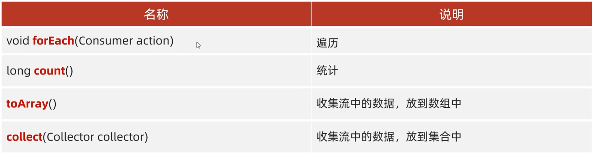
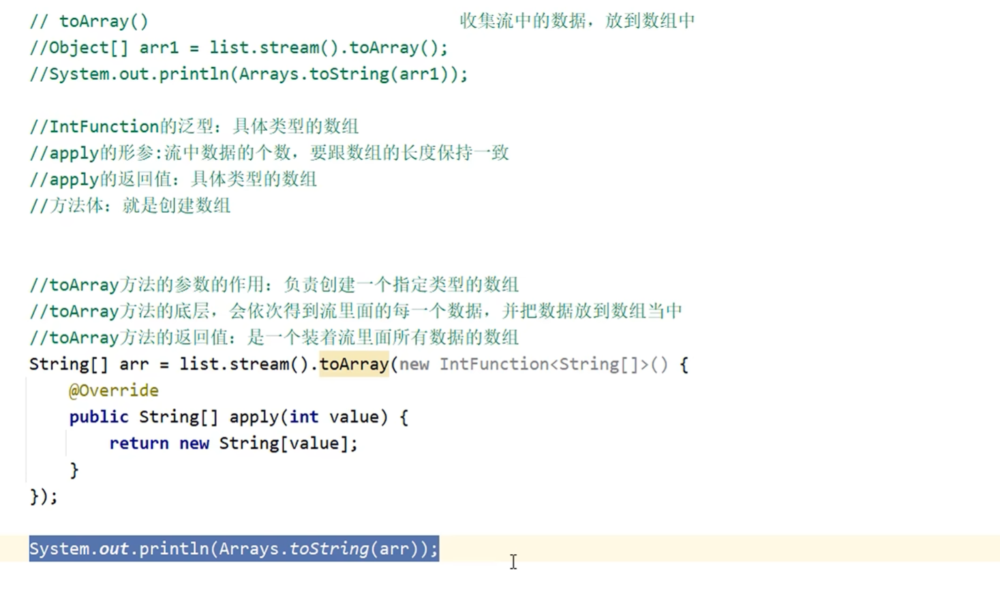
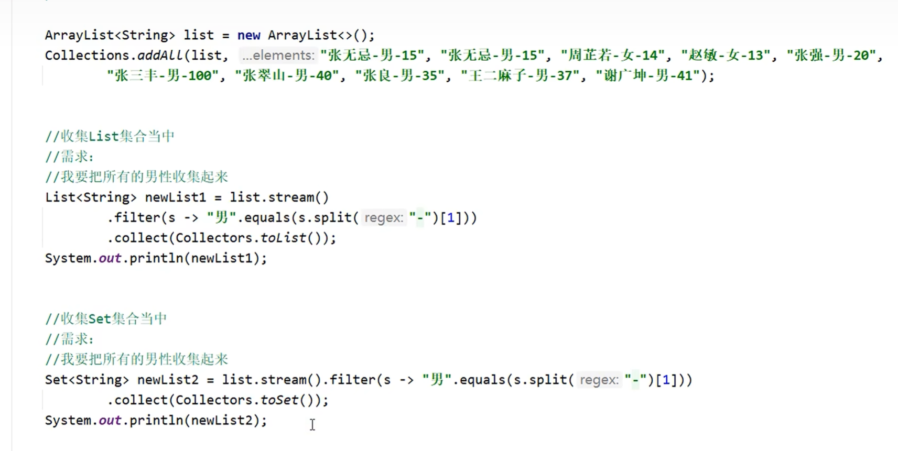

# Stream流的思想

## 一、什么是Stream流 Stream（流）

#### 是Java8新增的**集合数据处理工具**，可以以流水线、函数式的方式操作集合/数组数据。

####  核心思想：把数据看作流式水流，中间多次过滤、转换，最终得到想要结果。


## 二、Stream流的使用

##### 结合Lambda表达式，简化集合和数组的操作

### stream流的使用步骤：

1.先得到一条Stream流，并把数据放上去



### 1.1单列集合的使用方法:

```
public static void main(String[] args) {
    //单列集合的获取和使用方法
    ArrayList<String> list = new ArrayList<>();
    Collections.addAll(list,"a","b","c","d","e");
    //结合lambda的方式一起使用
    list.stream().forEach(s->System.out.println(s));


}
```


### 1.2双列集合的使用方法

```
public static void main(String[] args) {
    HashMap<Integer,String> hm = new HashMap<>();
    hm.put(1,"a");
    hm.put(2,"b");
    hm.put(3,"c");
    hm.put(4,"d");
    hm.put(5,"e");

   //第一种方法
    hm.keySet().forEach(System.out::println);

    //第二种方法
    hm.entrySet().forEach(System.out::println);
}
```

当数据是双列集合的时候，不能像单列集合那样直接在双列集合的实现列用，得先利用keyset或者entryset的方法才能使用

### 1.3数组的使用方法

```
public static void main(String[] args) {
    int [] arr1 = {1,2,4,5,67,8,9,0};
    Arrays.stream(arr1).forEach(System.out::println);

}
```


### 1.4零散数据的使用方法

```
public static void main(String[] args) {
    Stream.of(1,4,6,7,8,98).forEach(System.out::println);
}
```

是利用Steram的静态方法来使用的

#### Stream接口中静态方法of的细节

方法的形参是一个可变参数，可以传递一堆零散的数据，也可以传递数组
但是数组必须是引用数据类型的，如果传递基本数据类型，是会把整个数组当做一个元素，放到stream当中。


## 2.使用中间方法对流水线上的数据进行操作




### 2.1filter的使用方法

```
public static void main(String[] args) {
    ArrayList<String> list= new ArrayList<>();
        Collections.addAll(list,"张无忌","周芷若","赵敏","张强","张三丰","张翠山","张良","王二麻子","谢广坤");
    //获取张开头的元素
        list.stream().filter(s->s.startsWith("张")).forEach(System.out::println);
}
```


### 2.2limit（获取）的使用方法

```
//获取前三个元素的
   list.stream().limit(3).forEach(System.out::println);
```


### 2.3skip的使用方法

```
//跳过前4个元素
list.stream().skip(4).forEach(System.out::println);
```


### 2.4distinct(去重)和concat(合并流)的使用方法

```
public static void main(String[] args) {
    ArrayList<String> list1= new ArrayList<>();
        Collections.addAll(list1,"张无忌","张无忌","张无忌","张无忌","周芷若","赵敏","张强","张三丰","张翠山","张良","王二麻子","谢广坤");
    ArrayList<String> list2= new ArrayList<>();
    Collections.addAll(list2,"周芝诺","赵敏");
    list1.stream().distinct().forEach(System.out::println);

    Stream.concat(list1.stream(),list2.stream()).distinct().forEach(System.out::println);

}
```


2.5map的方法使用（转换数据类型）

```
public static void main(String[] args) {
    ArrayList<String> list= new ArrayList<>();
        Collections.addAll(list,"张无忌-15","周芷若-14","赵敏-11","张强-22","张三丰-11","张翠山-134");
        //匿名内部类的形式
        list.stream().map(new Function<String,Integer>() {
            @Override
            public Integer apply(String s) {
                //根据-的来切割
            String[] arr =  s.split("-");
            String str = arr[1];
            //转换数据类型
            int age = Integer.parseInt(str);
                return age;
            }
        }).forEach(System.out::println);
    System.out.println("----------------------------------------------------------");

        list.stream().map(s->Integer.parseInt(s.split("-")[1])).forEach(System.out::println);

}
```


## 3.使用终结方法对流水线上的数据进行操作






