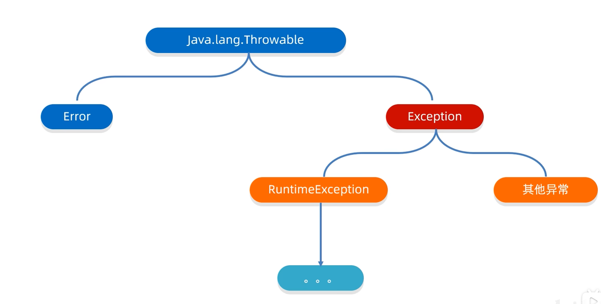
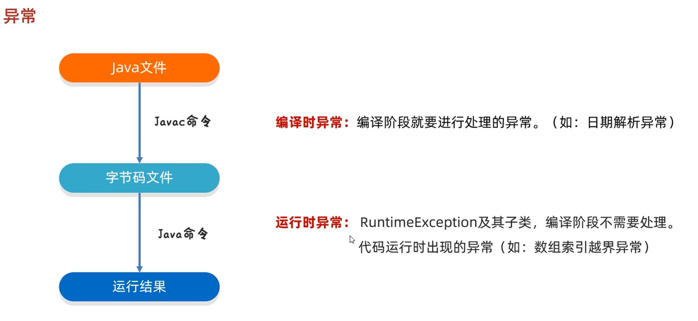

# 异常

Exception:叫做异常，代表程序可能出现的问题。
我们通常会用Exception以及他的子类来封装程序出现的问题。

运行时异常:RuntimeException及其子类，编译阶段不会出现异常提醒。运行时出现的异常(如:数组索引越界异常)

3.编译时异常和运行时异常的区别?
编译时异常:没有继承RuntimeExcpetion的异常，直接继承于Excpetion。
编译阶段就会错误提示
运行时异常:RuntimeException本身利子类。编译阶段没有错误提示，运行时出现的

