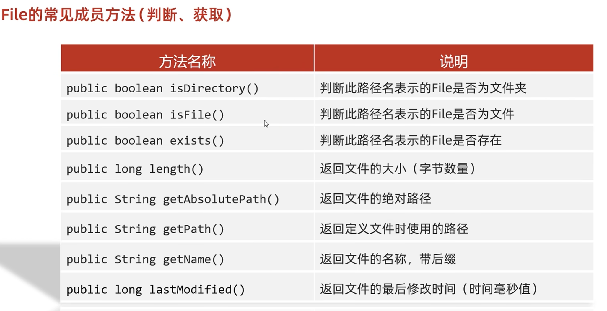
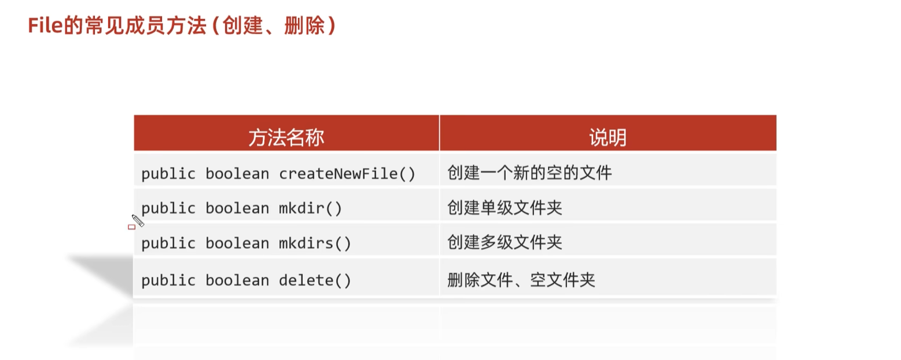
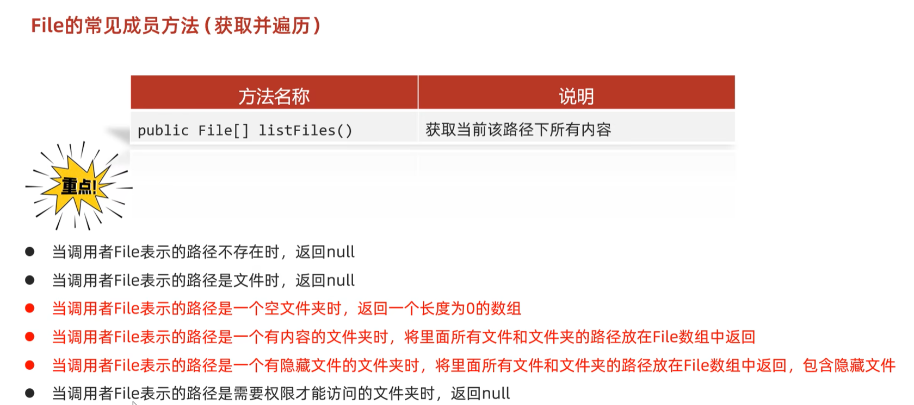

# File

File对象表示路径，可以是文件路径，也可以是文件夹路径

1.把字符串表示的路径变成file对象

```
public static void main(String[] args) {
    String str ="D:\\zhuomian\\a.txt";
    File file = new File(str);
    System.out.println(file);
}
```

#### D:\zhuomian\a.txt

#### Window下：”\\\”

这个路径可以是存在的，也可以是不存在的


## 绝对路径和相对路径的差别

绝对路径是带盘符的。
相对路径是不带盘符的，默认到当前项目下去找。

举个例子：相对路径就是当你创建一个文件夹的时候，直接用相对路径就是在文件夹里面找文件。

当使用绝对路径的时候就要有盘符，比如你文件在c盘然后你软件在d盘，然后你想在软件中使用的文件，就要带盘符


2.利用父类和子类拼接的构造方法（String类型）

```
 String pa ="D:\\zhuomian\\";
    String er = "a.txt";
    File file =new File(pa,er);
    System.out.println(file);
}
```


3.利用父类和子类拼接的构造方法（File类型）

```
File file = new File("D:\\zhuomian\\");
String file1="a.txt";
File file2 =new File(file, file1);
System.out.println(file2);
```


## File的常见成员方法




#### length()无法获取文件夹大小

#### 只能获取文件大小




```
public static void main(String[] args) throws IOException {
    File f1 =new File("D:\\zhuomian\\b.txt");
   Boolean f =  f1.createNewFile();
    System.out.println(f);

}
```

### 1.createNewFile 创建一个新的空的文件

细节1:如果当前路径表示的文件是不存在的，则创建成功，方法返回true

如果当前路径表示的文件是存在的，则创建失败，方法返回false

细节2:如果父级路径是不存在的，那么方法会有异常IOException

细节3:createNewFi1e方法创建的一定是文件，如果路径中不包含后缀名，则创建一个没有后缀的文件




```
public static void main(String[] args) throws IOException {
    File f1 =new File("D:\\zhuomian\\b.txt");
    File[] files = f1.listFiles();
    System.out.println(files);

}
```

表示文件所以为null


```
public static void main(String[] args) throws IOException {
    File f1 =new File("D:\\zhuomian\\c.txt");
    File[] files = f1.listFiles();
    System.out.println(files);

}
```

路径不存在也为null


```
public class file1 {
    public static void main(String[] args) throws IOException {
        File f1 =new File("D:\\zhuomian\\aaa");
        File[] files = f1.listFiles();
        System.out.println(files);

    }
}

[Ljava.io.File;@4eec7777
```

##### 因为是数组所以不能用打印，要不然只会打印地址值


```
public static void main(String[] args) throws IOException {
    File f1 =new File("D:\\zhuomian\\aaa");
    File[] files = f1.listFiles();
    for (File file : files) {
        System.out.println(file);
    }

}
D:\zhuomian\aaa\a.txt
D:\zhuomian\aaa\b.txt

```

## 创建一个文件夹和文件

```
public class file2 {
    public static void main(String[] args) throws IOException {
        File file =new File("D:\\zhuomian\\puzzlegame\\src\\com\\xiaowang\\File1\\aaa");
        boolean b = file.mkdirs();
        System.out.println(b);

        String str = "a.txt";
        File file3 = new File(file,str);
        boolean b1 = file3.createNewFile();
        System.out.println(b1);


    }
```


## 查找一个文件里面的全部内容

```
public class file3 {
    public static void main(String[] args) {
        File file1 =new File("D:\\zhuomian\\aaa");
        boolean b = haveiov(file1);
        System.out.println(b);

    }

    public static boolean haveiov(File file) {
        File[] files = file.listFiles();
        for (File file1 : files) {
            if(file1.isFile()&&file1.getName().endsWith(".avi")) {
                return true;
            }
        }
        return false;
    }
}
```
