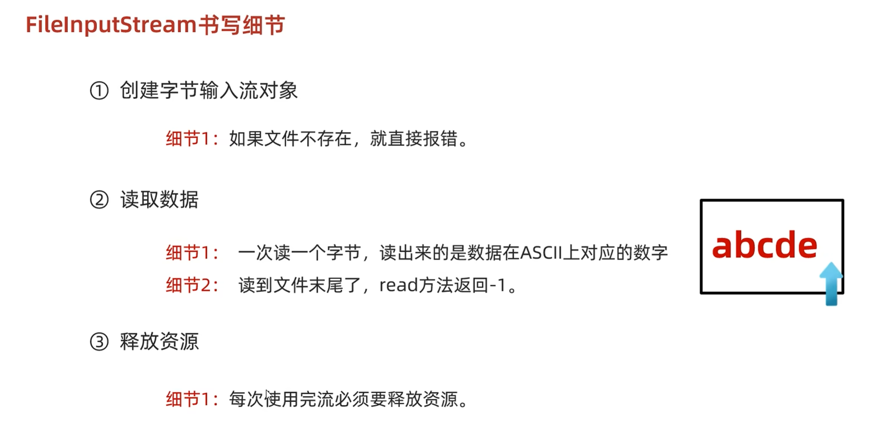

## FileInputStream

#### 是操作本地文件的字节输入流，就是把本地文件中的数据读取到程序中来。

循环输出

```
public static void main(String []args) throws IOException {
   FileInputStream fis = new FileInputStream("D:\\zhuomian\\IOliu\\a.txt");
    int b;
    while((b=fis.read())!=-1) {
        System.out.print((char)b);
    }

    fis.close();


}
```

bcdefghbcdefgh


