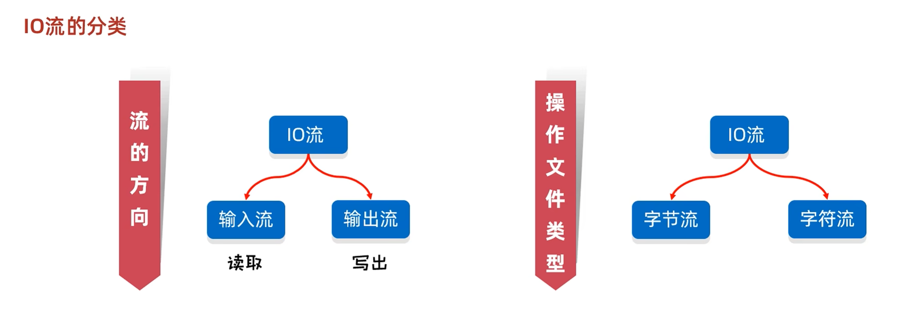
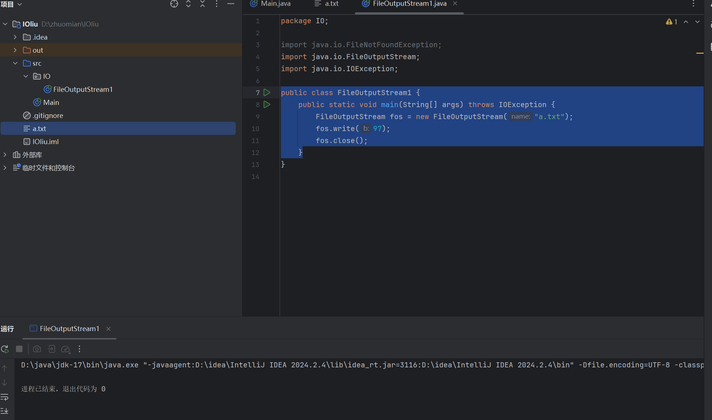

# IO流




## IO流：

### 存储和读取数据的解决方案

### i:input  o:output


### 字符流：window记事本能读懂的（.md/.txt）


## FileOutputStream的简单运用

```
public class FileOutputStream1 {
    public static void main(String[] args) throws IOException {
        FileOutputStream fos = new FileOutputStream("a.txt");
        fos.write(97);
        fos.close();
    }
```



```
a
```


字节输出流的细节:
1.创建字节输出流对象
细节1:参数是字符串表示的路径或者是File对象都是可以的
细节2:如果文件不存在会创建一个新的文件，但是要保证父级路径是存在的。
细节3:如果文件已经存在，则会清空文件
2.写数据
细节:write方法的参数是整数，但是实际上写到本地文件中的是整数在ASCII上对应的字符
3.释放资源
每次使用完流之后都要释放资源


## write的三种使用方法

```
  FileOutputStream fos = new FileOutputStream("a.txt");
    //第一种方法写出数据
    fos.write(98);
    //第二种方法写出数据
    byte [] bytes = {99,100,101,102,103,104};
    fos.write(bytes);

    //第三种方法写出数据
    fos.write(bytes,1,3);


    fos.close();
}
```


## FileOutputStream的换行和续写

```
public class demo {
    public static void main(String[] args) throws IOException {
        FileOutputStream fos = new FileOutputStream("a.txt", true);
        //第一种方法写出数据
        fos.write(98);
        //第二种方法写出数据
        byte [] byte1 = {99,100,101,102,103,104};
        String str = new String("\r\n");
        byte[] byte2 = str.getBytes();
        fos.write(byte2);


        fos.write(byte1);

        //第三种方法写出数据
        //fos.write(bytes,1,3);


        fos.close();
    }
}
```

```
b
cdefghb
cdefgh

```


