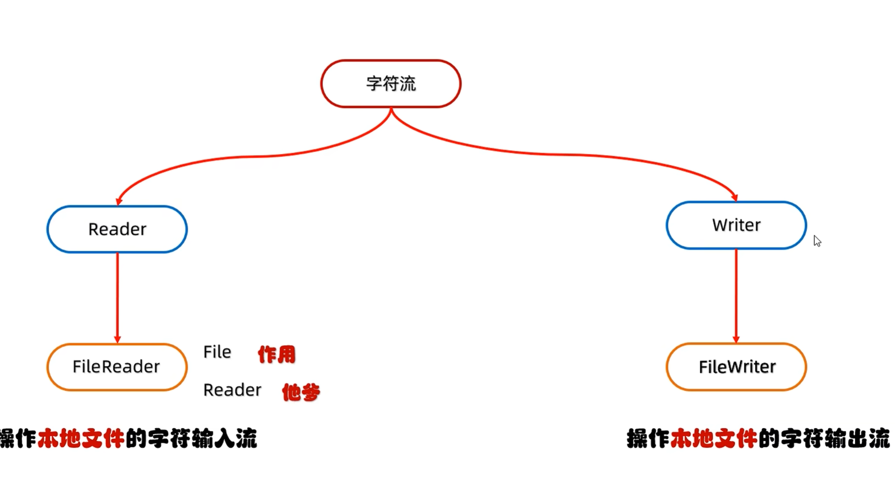
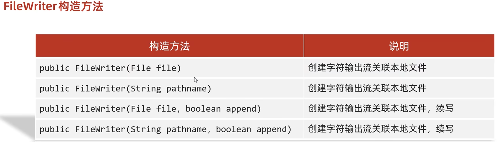
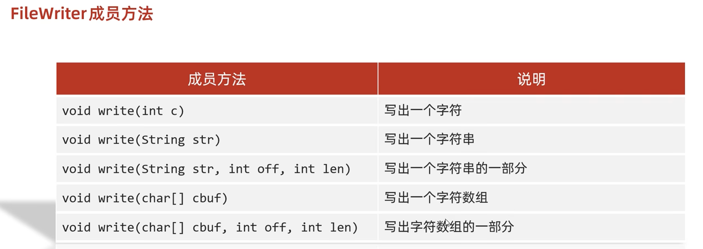

# 字符流

## 1.特点

字符流=字节流＋字符集

特点
输入流:一次读一个字节，遇到中文时，一次读多个字节
输出流:底层会把数据按照指定的编码方式进行编码，变成字节再写到文件中



## 2.FileReader

```
public class demo2 {
    public static void main(String[] args) throws IOException {
        FileReader fr = new FileReader("D:\\zhuomian\\IOliu\\a.txt");

        int a;
        while((a = fr.read())!=-1) {
            System.out.print((char)a);
        }
        fr.close();


    }
}
```

```
你们好啊，今天是周五，我考完试欸
```

### Read()的细节：

read()：默认是一个一个字节读取的，如果遇见中文就会读取多个字节，根据字符集规则来

在读取之后，方法的底层还会进行解码并转为十进制


## 3.FileWriter



