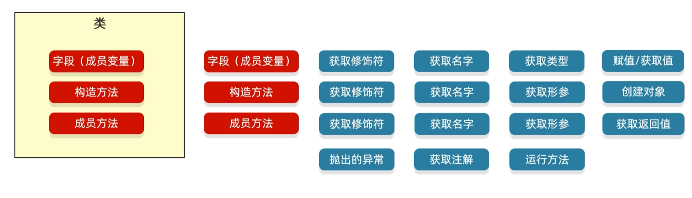

# 反射

#### 反射允许对成员变量，成员方法和构造方法的信息进行编程访问

通俗理解就是反射可以在类里面把东西拿出来，拿成员变量，构造方法，成员方法



我们从类中获取东西的时候，我们不是在字节码文件中获取的，我们是通过。class文件来获取的。

## 获取class对象的三种方式

### (1)Class.forName("全类名")

```
//第一种获取方法
 //最为常用
 Class aClass = Class.forName("classdemo.Student");
 System.out.println(aClass);
```

### （2）类名.class

```
//第二种获取方法
//通常做为参数进行使用
Class studentClass = Student.class;
System.out.println(studentClass);
```


### (3)对象.getClass();

```
//第三种获取方法
//当我们有这个对象的时候才能使用
Student student = new Student();
Class aClass1 = student.getClass();
System.out.println(aClass1);
```


`class classdemo.Student`
`class classdemo.Student`
`class classdemo.Student`


## 利用反射获取构造方法

```
package classdemo;

import java.lang.reflect.Constructor;
import java.lang.reflect.InvocationTargetException;
import java.lang.reflect.Parameter;

public class Test2 {
    public static void main(String[] args) throws ClassNotFoundException, NoSuchMethodException, InvocationTargetException, InstantiationException, IllegalAccessException {
        //获取class文件
        Class<?> clazz = Class.forName("classdemo.Student");
        //获取公共的构造方法（Constructors）
        Constructor[] a = clazz.getConstructors();
        for (Constructor constructor : a) {
            System.out.println(constructor);
        }
        System.out.println("------------------------------------------------------");
        //获取全部的构造方法包括private修饰的，Declared表示带权限的
        Constructor[] b = clazz.getDeclaredConstructors();
        for (Constructor constructor : b) {
            System.out.println(constructor);
        }
        System.out.println("------------------------------------------------------");
        //获取单个对象的构造方法
        Constructor c = clazz.getConstructor(String.class, int.class);
        System.out.println(c);
        System.out.println("------------------------------------------------------");
        //获取带有权限的单个对象的构造方法
        Constructor<?> d = clazz.getDeclaredConstructor(int.class);
        System.out.println(d);
        System.out.println("------------------------------------------------------");
        //获取修饰符
        //暴利获取
         d.setAccessible(true);
        int modifiers = d.getModifiers();
        System.out.println(modifiers);

        //获取里面的参数
        System.out.println("------------------------------------------------------");
        Parameter[] parameters = d.getParameters();
        for (Parameter parameter : parameters) {
            System.out.println(parameter);
        }
        System.out.println("------------------------------------------------------");
        //创建对象
        Student o = (Student) c.newInstance("张三", 18);
        System.out.println(o);

    }
}
```

```
package classdemo;

public class Student {
    private String name;
    private int age;

    public Student() {
    }
    public Student(String name) {
        this.name = name;
    }
    private Student(int age) {
        this.age = age;
    }

    public Student(String name, int age) {
        this.name = name;
        this.age = age;
    }

    /**
     * 获取
     * @return name
     */
    public String getName() {
        return name;
    }

    /**
     * 设置
     * @param name
     */
    public void setName(String name) {
        this.name = name;
    }

    /**
     * 获取
     * @return age
     */
    public int getAge() {
        return age;
    }

    /**
     * 设置
     * @param age
     */
    public void setAge(int age) {
        this.age = age;
    }

    public String toString() {
        return "Student{name = " + name + ", age = " + age + "}";
    }
}
```

```
public classdemo.Student()
public classdemo.Student(java.lang.String,int)
public classdemo.Student(java.lang.String)
------------------------------------------------------
public classdemo.Student()
public classdemo.Student(java.lang.String,int)
private classdemo.Student(int)
public classdemo.Student(java.lang.String)
------------------------------------------------------
public classdemo.Student(java.lang.String,int)
------------------------------------------------------
private classdemo.Student(int)
------------------------------------------------------
2
------------------------------------------------------
int arg0
------------------------------------------------------
Student{name = 张三, age = 18}
```


## 利用反射获取成员变量

```
package classdemo;

import java.lang.reflect.Field;

public class Test3 {
    public static void main(String[] args) throws ClassNotFoundException, NoSuchFieldException, IllegalAccessException {
        //获取公共的成员变量
        Class clazz = Class.forName("classdemo.Student");
        Field[] a = clazz.getFields();
        for (Field field : a) {
            System.out.println(field);
        }
        System.out.println("-----------------------");
        //获取全部的成员变量
        Field[] b = clazz.getDeclaredFields();
        for (Field field : b) {
            System.out.println(field);
        }


        System.out.println("-----------------------");
        //获取单个公共的成员变量
        Field c = clazz.getField("gender");
        System.out.println(c);
        System.out.println("-----------------------");
        Field name = clazz.getDeclaredField("name");
        System.out.println(name);

        System.out.println("-----------------------");
        //获取修饰符
        name.setAccessible(true);
        int modifiers = name.getModifiers();
        System.out.println(modifiers);

        System.out.println("-----------------------");
        //获取成员变量的名字
        String name1 = name.getName();
        System.out.println(name1);
        System.out.println("-----------------------");
        //获取成员变量的数据类型
        Class<?> type = name.getType();
        System.out.println(type);
        System.out.println("-----------------------");
        //获取成员变量记录的值
        Student stu = new Student("zhangsan",18);
        String o =(String) name.get(stu);
        System.out.println(o);
        System.out.println("-----------------------");
        name.set(stu,"lisi");
        System.out.println(stu);
    }
}
```

```
public java.lang.String classdemo.Student.gender
-----------------------
private java.lang.String classdemo.Student.name
private int classdemo.Student.age
public java.lang.String classdemo.Student.gender
-----------------------
public java.lang.String classdemo.Student.gender
-----------------------
private java.lang.String classdemo.Student.name
-----------------------
2
-----------------------
name
-----------------------
class java.lang.String
-----------------------
zhangsan
-----------------------
Student{name = lisi, age = 18}
```

