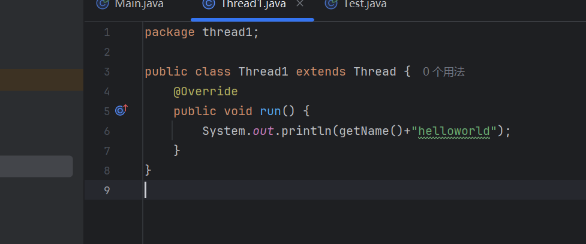
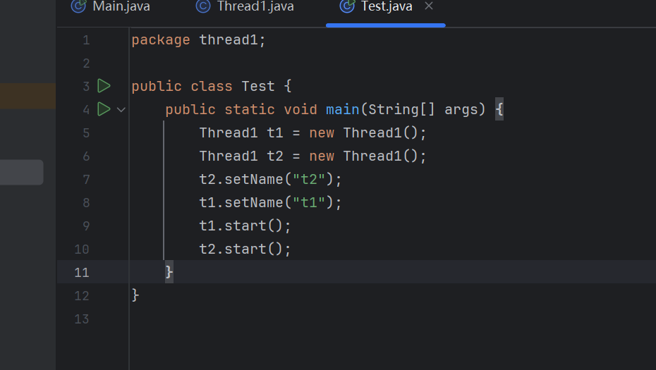
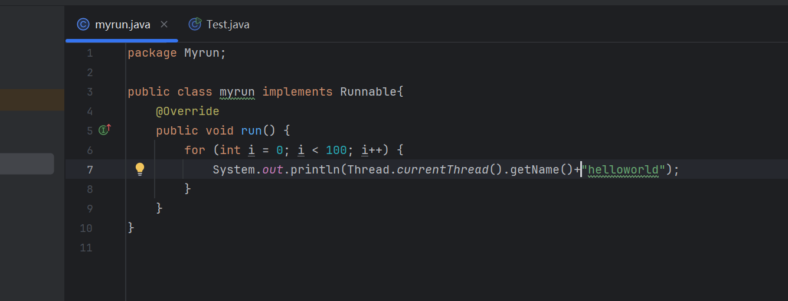
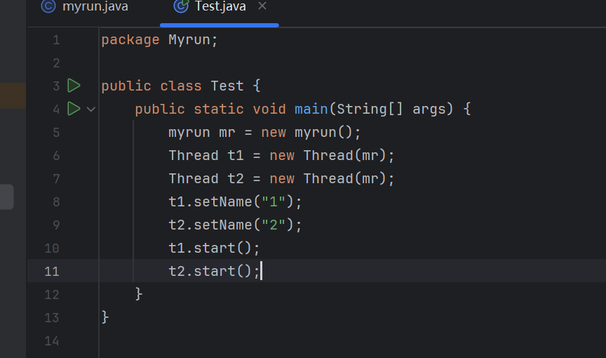
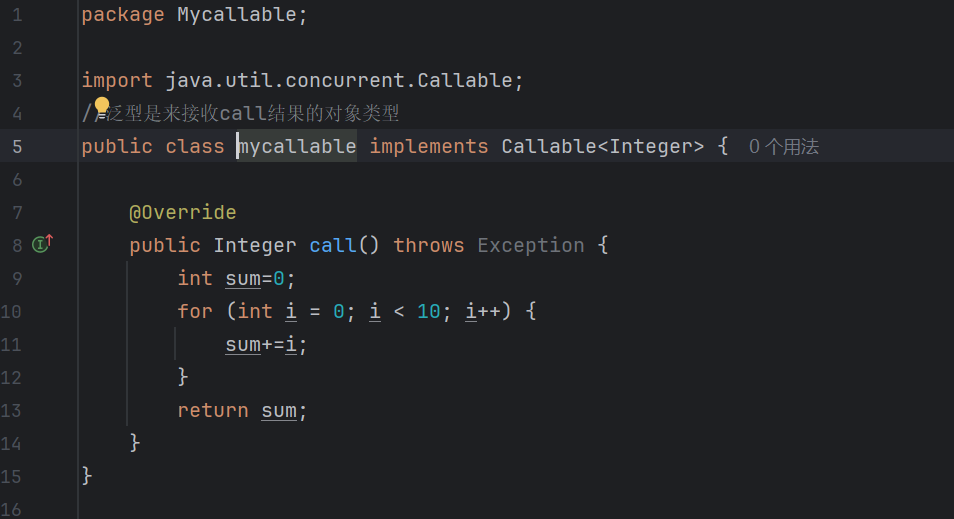
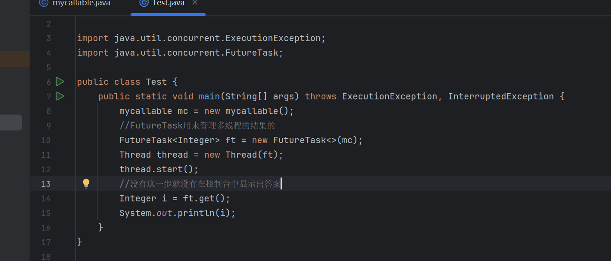
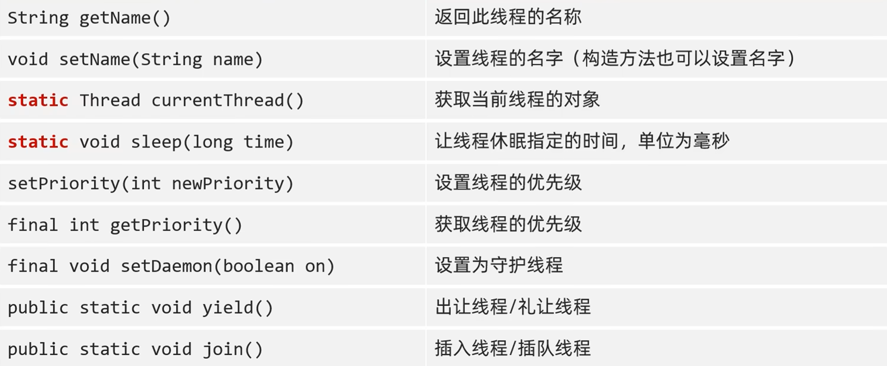

# 多线程理解

一个软件的运行就是一个进程，而线程就是进程里面的单位，就是应用软件相互独立，可以同时运行的功能

多线程可以提高效率

就是当我们写程序的时候，cpu可以利用不同的时间差来完成多件事情

# 并发

就是在同一个时刻上，有多个指令在单个CPU上交替执行

# 并行

在同一个时刻，有多个指令在多个CPU上同时执行

# 多线程实现方法

## 1.Thread方法

1.1要想使用Thread方法必须要创建一个继承的子类并重写run方法

1.2要创建一个实现类来调用

## 2.Runable接口

要一个具体的类来实现Runable的接口的继承

先创建一个实现类的对象，再创建一个Thread类的对象

## 3.FutureMark和callable来实现

## 对比

想获取结果就用第三类，不想获取结果就用第一类或者第二类

# 常见的成员方法

