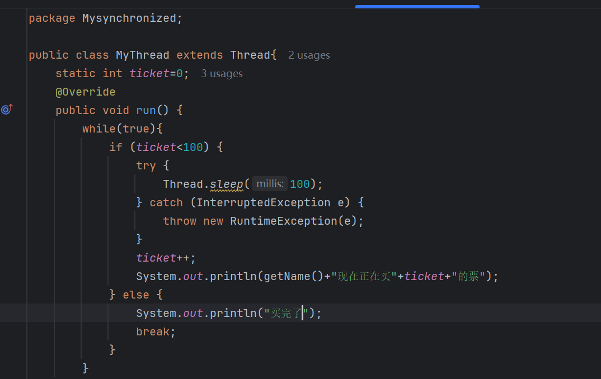
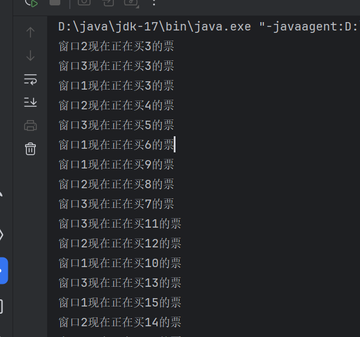
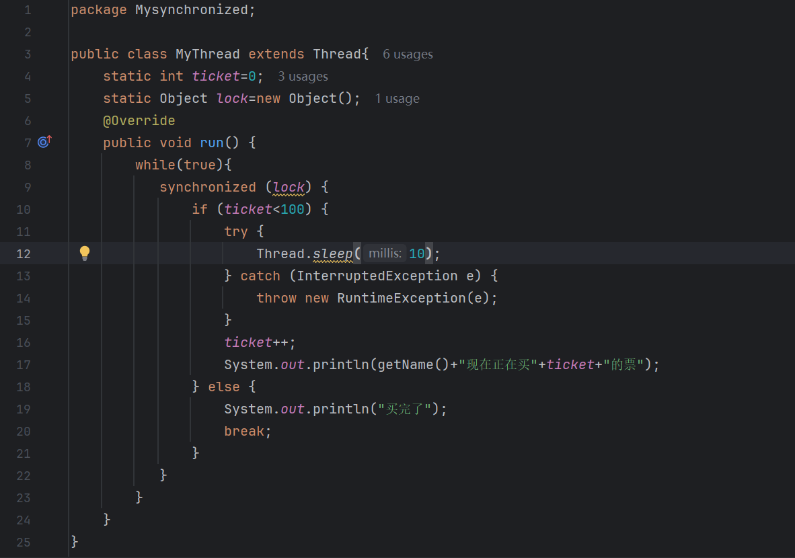
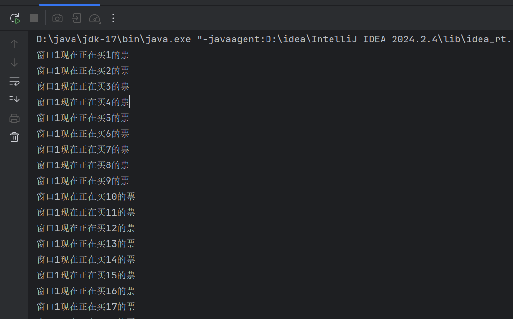
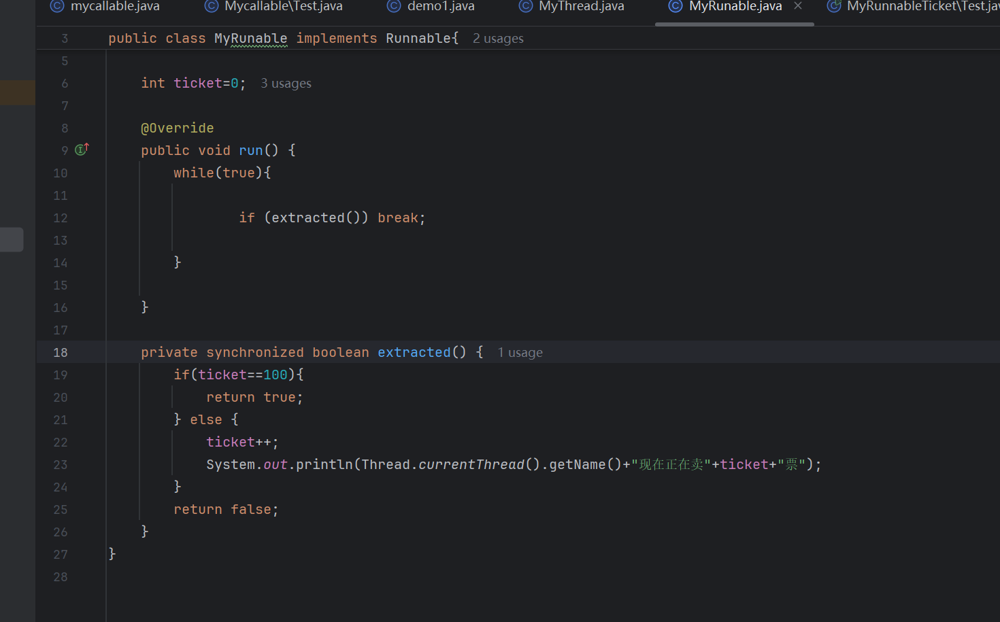

# 线程安全

## 1.什么是线程安全

#### 当多个线程同时访问同一个共享资源时，程序还能保持正确的结果，这就是线程安全。


## 2.线程安全问题是怎么产生的？

比如有一段代码是

```
public class Test {
    static int count = 0;
```

    public static void main(String[] args) {
    
    }
}

现在有两个线程A和B，A和B都执行count++；我们期望的结果是count=2；

但是当我们执行的时候可能出现结果为1的情况，因为当A执行的时候B也执行，但是B拿到的数据有旧的数据，然后A先算完了，A的结果是1，然后B也算完了,B的结果也是1，B的结果就会覆盖A的结果


## 3线程安全的结果方法

#### 不让多个线程同时修改共享数据。

#### 有三种主要方式：

### 3.1synchronized同步锁

当有一个线程访问的时候就不允许其他线程访问

保证同一时间只有一个线程访问被锁住的代码。

本质： 将并行修改变成串行执行。

### 当没用synchronized方法的时候





### 会出现相同的票被三个进程所买


### 当使用了之后





## synchronized的细节

#### 不能写在循环外面，要不然当有一个线程进入之后，得执行完循环之后才能被释放，

#### 锁对象必须要唯一的synchronized必须使用同一个锁对象。

如果每个线程拿不同锁： 线程之间无法互相限制。

### 同步synochronized方法



