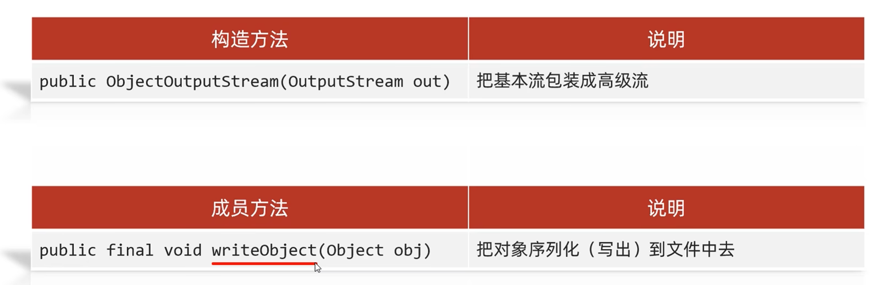

# 序列化流

### 1.可以把java中的对象写到本地文件中




```
package IO;

import java.io.*;

public class demo10 {
    public static void main(String[] args) throws IOException, ClassNotFoundException {
       Student s1 = new Student("zhangsan",18);

       ObjectOutputStream oos = new ObjectOutputStream(new FileOutputStream("D:\\zhuomian\\IOliu\\ddd.txt"));
       oos.writeObject(s1);

        ObjectInputStream ois = new ObjectInputStream(new FileInputStream("D:\\zhuomian\\IOliu\\ddd.txt"));
        Object o = ois.readObject();
        System.out.println(o);
        oos.close();
        ois.close();

    }

```


Student{name = zhangsan, age = 18}


### 2.要是想把文件objectoutputstream的话，得要再你想输出的类加入Serializable接口才能输出，要不然会报错

```
package IO;

import java.io.Serializable;

public class Student implements Serializable {
    private String name;
    private int age;


    public Student() {
    }

    public Student(String name, int age) {
        this.name = name;
        this.age = age;
    }

    /**
     * 获取
     * @return name
     */
    public String getName() {
        return name;
    }

    /**
     * 设置
     * @param name
     */
    public void setName(String name) {
        this.name = name;
    }

    /**
     * 获取
     * @return age
     */
    public int getAge() {
        return age;
    }

    /**
     * 设置
     * @param age
     */
    public void setAge(int age) {
        this.age = age;
    }

    public String toString() {
        return "Student{name = " + name + ", age = " + age + "}";
    }
}
```


### 3.要在类中加入版本号，要不然当修改的时候就会报错