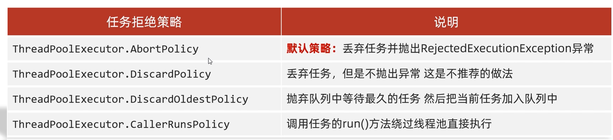
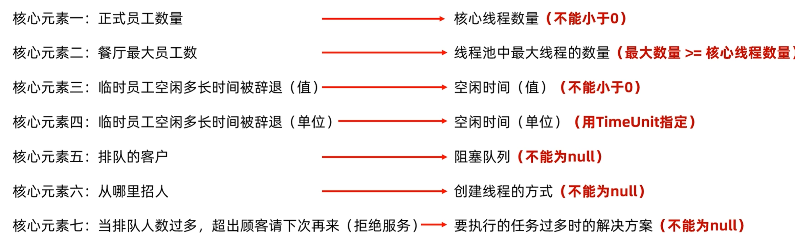

# 线程池

## 线程池的底层原理：刚刚开始会创建一个空的线程池，当有任务提交的时候，线程池里面就会创建线程对象，当任务执行完毕之后，线程就归还池子，当下次使用的时候就会直接复用已经有的线程就行，当线程全部都在使用的时候，任务就会进入等待


## 线程池的两种方法

1.public static ExecutorService new CachedThreadPool()

创建一个没有上限的线程池

2.

public static ExecutorService newFixedThreadPool(int nThreads)

创建有上限的线程池


## 代码实现


```
public class xianchenci1 {
    public static void main(String[] args) {
        //ExecutorService pool1 = Executors.newCachedThreadPool();
        ExecutorService pool1 = Executors.newFixedThreadPool(2);
        pool1.submit(new MyRunable());
        pool1.submit(new MyRunable()); pool1.submit(new MyRunable());
        pool1.submit(new MyRunable());
    }
}
```

```
package xianchengci;

public class MyRunable implements Runnable{

    @Override
    public void run() {
        for (int i = 0; i < 100; i++) {
            System.out.println(Thread.currentThread().getName()+i);
        }


    }
}
```


## 自定义线程池

当创建一个线程池的时候里面有三个核心线程，三个临时线程，队伍长度只有三的时候

当有一个是三个任务的队列来的时候，就会优先安排三个核心线程来解决

当有一个是五个任务队列来的时候，就会安排三个核心线程来解决，剩下的两个线程放入队伍中等待，只有队伍中排队的线程也满了的时候才会创建临时线程来帮忙。

当有十个任务来的时候，就会舍弃一个任务，

任务拒绝策略有



默认用第一个




## 自定义线程池的代码实现

```
package xianchengci;

import java.util.concurrent.ArrayBlockingQueue;
import java.util.concurrent.ThreadPoolExecutor;
import java.util.concurrent.TimeUnit;

public class MyEx {
    public static void main(String[] args) {
        ThreadPoolExecutor pool = new ThreadPoolExecutor(
                3,//核心线程
                6,//线程池中最多可以创建的对象
                60,//空闲时间
                TimeUnit.SECONDS,//空闲时间的单位
                new ArrayBlockingQueue<>(3),//阻塞队列的长度
                new ThreadPoolExecutor.AbortPolicy());//策略


    }
}
```
