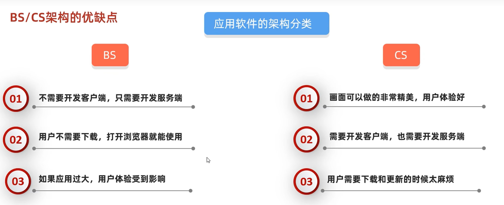
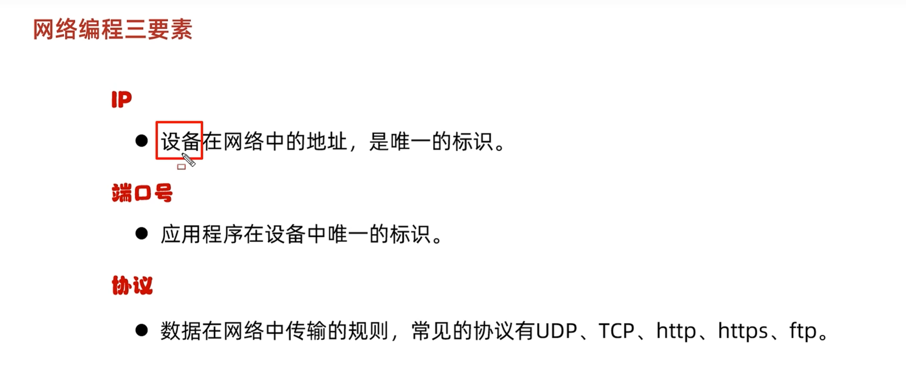

# 网络编程






## UTP协议

### 无连接不可靠的协议

```
package MyUTP;

import java.io.IOException;
import java.net.DatagramPacket;
import java.net.DatagramSocket;
import java.net.InetAddress;
import java.net.SocketException;

public class myutp {
    public static void main(String[] args) throws IOException {
        DatagramSocket dg = new DatagramSocket();
        String str ="你好";
        byte[] bytes = str.getBytes();
        InetAddress address = InetAddress.getByName("127.0.0.1");
        int port = 8080;
        DatagramPacket dp = new DatagramPacket(bytes, bytes.length, address, port);
        dg.send(dp);
        dg.close();
    }
}
```

```
package MyUTP;

import java.io.IOException;
import java.net.DatagramPacket;
import java.net.DatagramSocket;
import java.net.SocketException;

public class myrecive {
    public static void main(String[] args) throws IOException {
        DatagramSocket socket = new DatagramSocket(8080);
        byte[]buf = new byte[1024];
        DatagramPacket packet = new DatagramPacket(buf, buf.length);
        socket.receive(packet);
        byte[] data = packet.getData();
        int length = packet.getLength();
        System.out.println(new String(data, 0, length));

        socket.close();
    }
}
```

##   UDP 三种通信方式

// 单播：指定具体 IP（最常用）
  DatagramPacket packet = new DatagramPacket(bytes, bytes.length,
      InetAddress.getByName("192.168.1.100"), 8080);

  // 组播：一组地址，群聊（224.0.0.0 ~ 239.255.255.255）
  DatagramPacket packet = new DatagramPacket(bytes, bytes.length,
      InetAddress.getByName("224.0.0.1"), 8080);

  // 广播：局域网内所有人（255.255.255.255）
  DatagramPacket packet = new DatagramPacket(bytes, bytes.length,
      InetAddress.getByName("255.255.255.255"), 8080);


##  三、TCP 编程