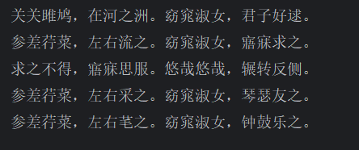

# 转换流

1.指定字符编码都来读写，必须确保文件是ansi的本地文件

```
public class demo7 {
    public static void main(String[] args) throws IOException {
        //指定字符编码来读写
        FileReader fr = new FileReader("D:\\zhuomian\\IOliu\\bbb.txt", Charset.forName("GBK"));
        int ch;
        while ((ch = fr.read()) != -1) {
            System.out.print((char) ch);
        }
        fr.close();
    }
}
```




2.对文件先进行gbk的读取，再utf-8输出

```
package IO;

import java.io.FileReader;
import java.io.FileWriter;
import java.io.IOException;
import java.nio.charset.Charset;

public class demo8 {
    public static void main(String[] args) throws IOException {
        //对文件进行gbk转换成utf-8
        FileReader fr = new FileReader("D:\\zhuomian\\IOliu\\bbb.txt", Charset.forName("GBK"));
        FileWriter fw = new FileWriter("D:\\zhuomian\\IOliu\\ccc.txt", Charset.forName("utf-8"));

        int b;
        while ((b = fr.read()) != -1) {
            fw.write(b);
        }
        fr.close();
        fw.close();
    }
}
```