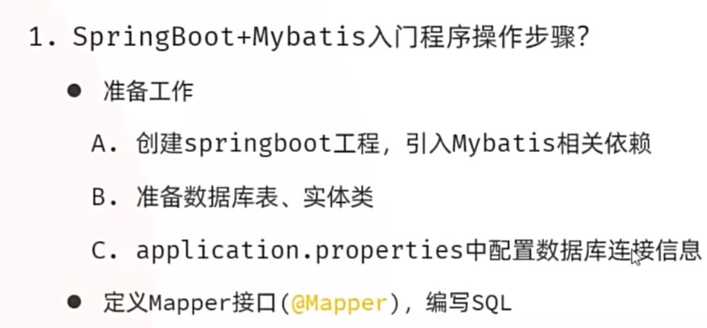

# Mybatis



## 配置依赖

```
spring.application.name=springboot-demo

spring.datasource.url = jdbc:mysql://localhost:3306/db2
spring.datasource.driver-class-name=com.mysql.cj.jdbc.Driver
spring.datasource.username=root
spring.datasource.password=1234
```


## 创建数据库表并插入数据

```
create table user(
    id int unsigned primary key auto_increment comment 'ID,主键',
    username varchar(20) comment '用户名',
    password varchar(32) comment '密码',
    name varchar(10) comment '姓名',
    age tinyint unsigned comment '年龄'
) comment '用户表';

insert into user(id, username, password, name, age)
values
(1, 'daqiao', '123456', '大乔', 22),
(2, 'xiaoqiao', '123456', '小乔', 18),
(3, 'diaochang', '123456', '貂蝉', 24),
(4, 'lvbu', '123456', '吕布', 28),
(5, 'zhaoyun', '12345678', '赵云', 27);
```


## 创建实体类user

```
package org.example.springbootdemo.pojo;

import lombok.AllArgsConstructor;
import lombok.Data;
import lombok.NoArgsConstructor;

@Data
@AllArgsConstructor
@NoArgsConstructor
public class user {
    private Integer id;
    private String username;
    private String password;
    private String name;
    private Integer age;

}
```


## 创建usermapper接口

```
package org.example.springbootdemo.mapper;

import org.apache.ibatis.annotations.Mapper;
import org.apache.ibatis.annotations.Select;
import org.example.springbootdemo.pojo.user;

import java.util.List;

@Mapper
public interface UserMapper {
    @Select("select * from user")
    public  List<user> findAll();
}
```


## 测试类

```
public void run(String... args) throws Exception {
    System.out.println("=======开始查询用户数据=======");
    List<user> userList = usermapper.findAll();
    userList.forEach(System.out::println);
    System.out.println("=======查询结束=======");
}
```


## 查询结果

