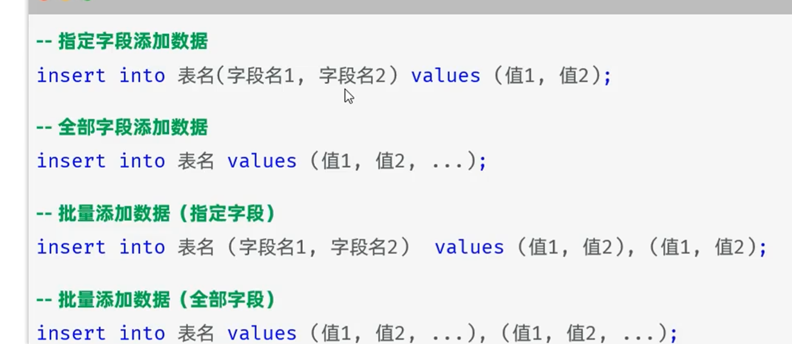
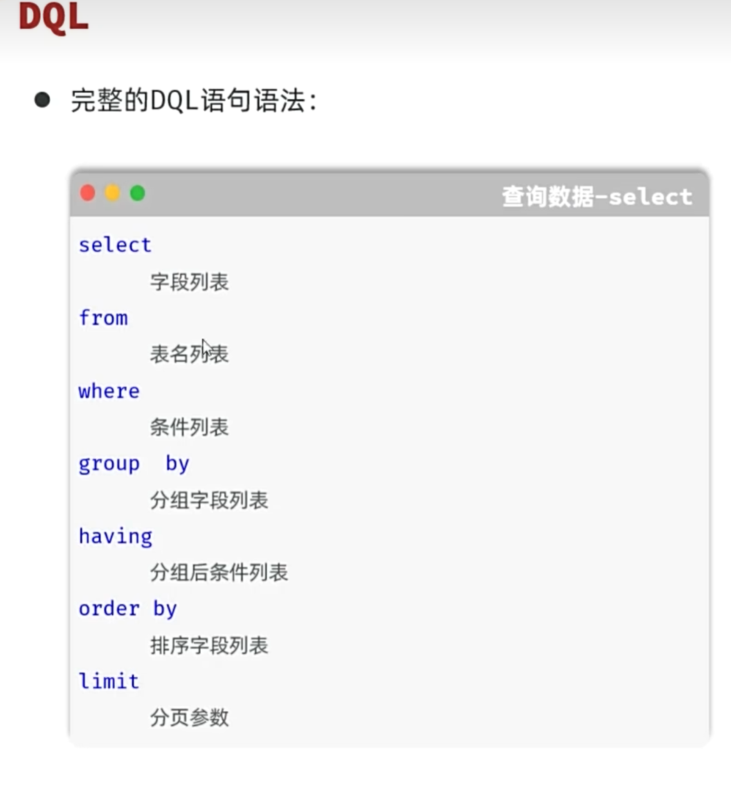
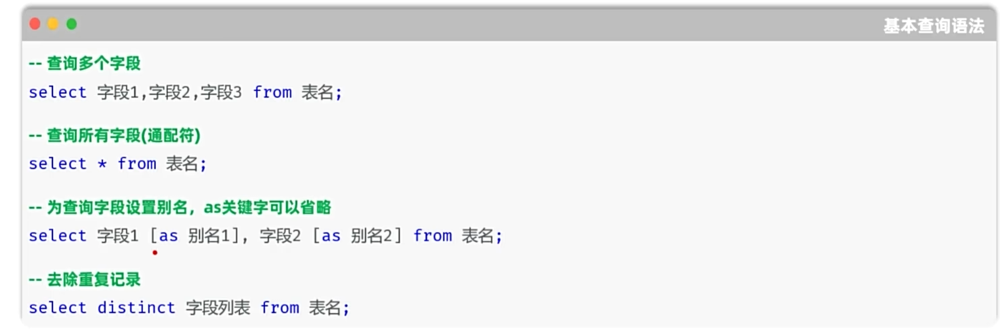
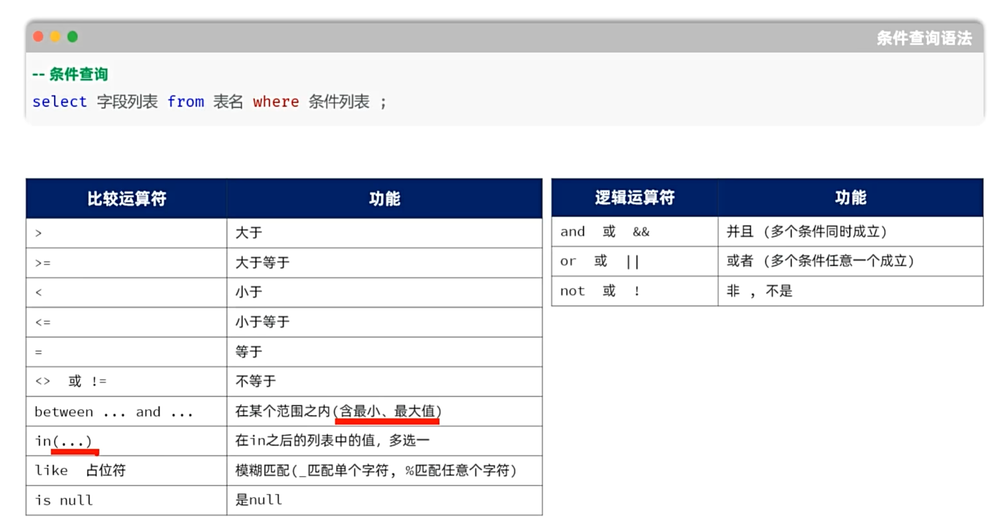
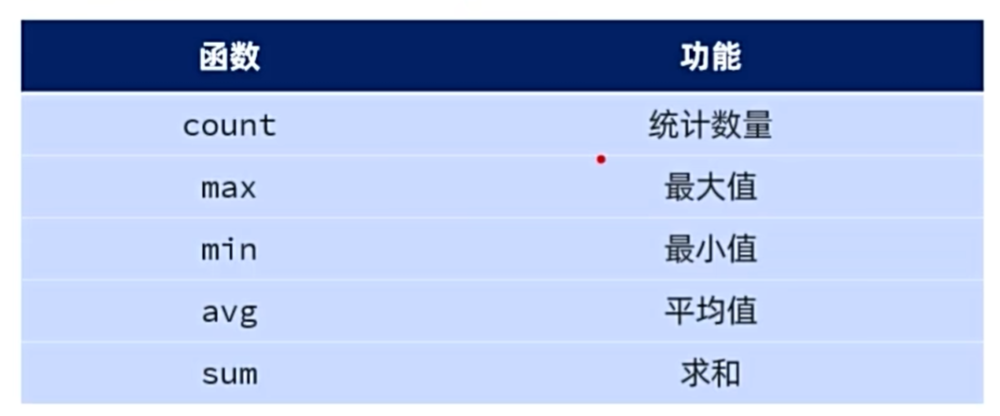
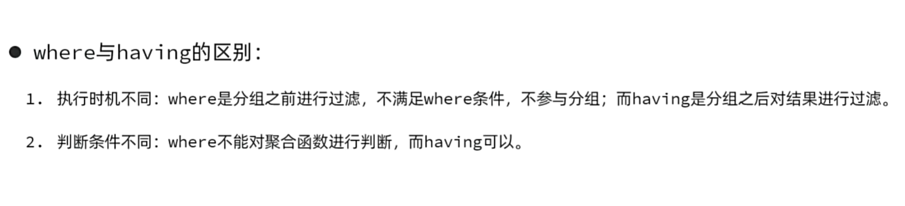
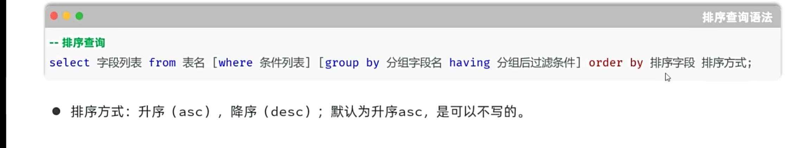

# DML

## Insert-添加




# DQL








## 分组查询伴随着聚合函数






```
select count(id) from emp;

select gender,count(*) from emp  group by gender having count(*)>15;
```


## 排序查询



```
select * from emp order by money asc,entry_date desc ;
```


## 分页查询


要是每一页查五个数据

那么起始索引=（页码-1）*每一页的数据