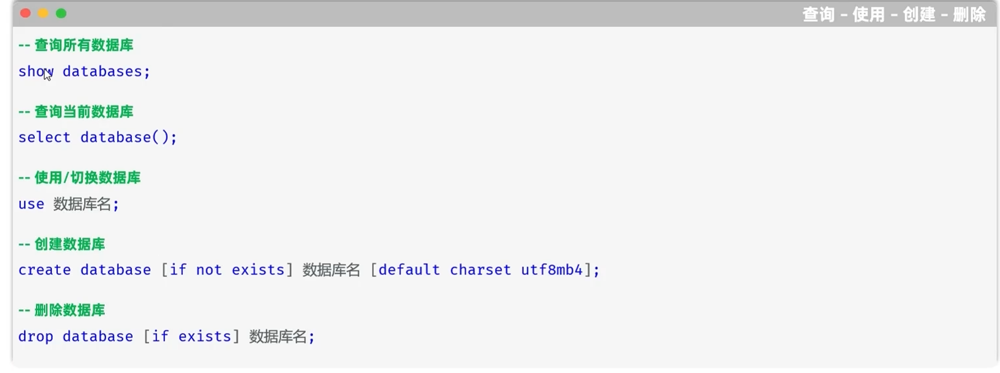
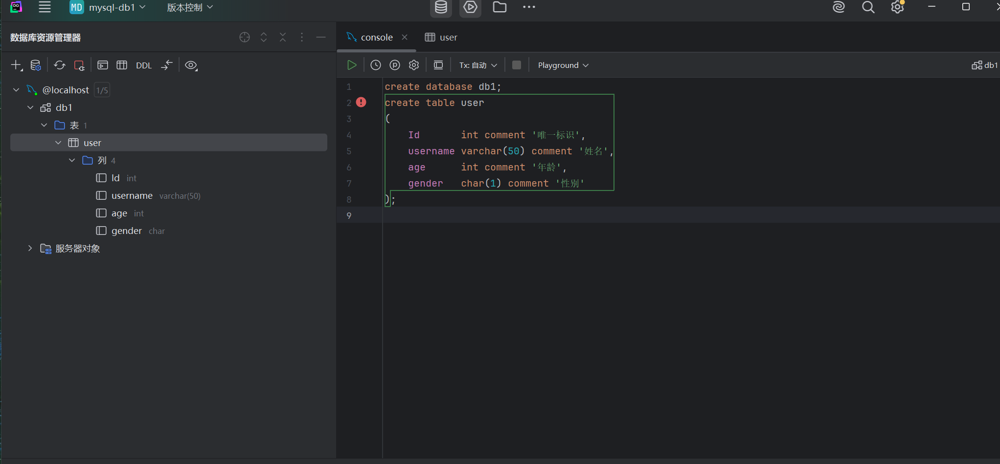
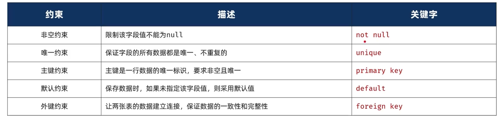
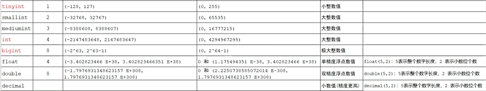
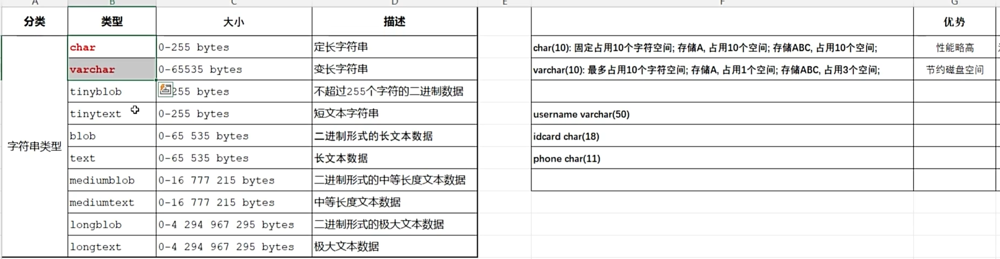
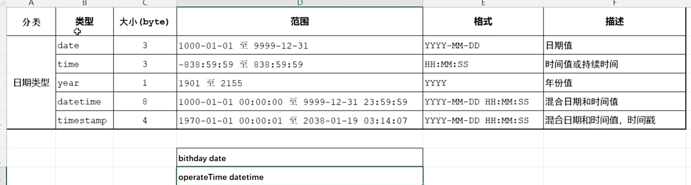
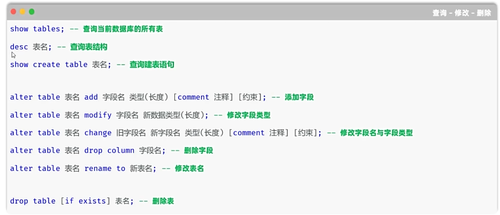

# Mysql


## DDL



mysql> show databases;
+--------------------+
| Database           |
+--------------------+
| information_schema |
| mysql              |
| performance_schema |
| sys                |
+--------------------+
4 rows in set (0.01 sec)
mysql> select database();
+------------+
| database() |
+------------+
| NULL       |
+------------+
1 row in set (0.00 sec)


mysql> create database db1;
Query OK, 1 row affected (0.01 sec)

mysql> show databases;
+--------------------+
| Database           |
+--------------------+
| db1                |
| information_schema |
| mysql              |
| performance_schema |
| sys                |
+--------------------+
5 rows in set (0.00 sec)

mysql> create database if not exists db2 default charset utf8mb4;
Query OK, 1 row affected (0.01 sec)

mysql> show databases;
+--------------------+
| Database           |
+--------------------+
| db1                |
| db2                |
| information_schema |
| mysql              |
| performance_schema |
| sys                |
+--------------------+
6 rows in set (0.00 sec)
mysql> drop database db1;
Query OK, 0 rows affected (0.01 sec)

mysql> show databases;
+--------------------+
| Database           |
+--------------------+
| db2                |
| information_schema |
| mysql              |
| performance_schema |
| sys                |
+--------------------+
5 rows in set (0.00 sec)


## 创建表

```
create table user
(
    Id       int comment '唯一标识',
    username varchar(50) comment '姓名',
    age      int comment '年龄',
    gender   char(1) comment '性别'
)
```



## 约束



```
create table user
(
    Id int  primary key  auto_increment comment '唯一标识',
    username varchar(50) not null  unique comment '姓名',
    age      int comment '年龄',
    gender   char(1) default '男'comment '性别'
);
```


## 数据类型的范围




## char类型的范围



## 时间类型范围




## 表结构的查询



```
show tables ;

desc emp;

show create table emp;

alter table emp add qq varchar(13) ;

alter table emp modify qq varchar(15);

alter table emp change qq qq_num varchar(15);

alter table emp drop column qq_num;
```