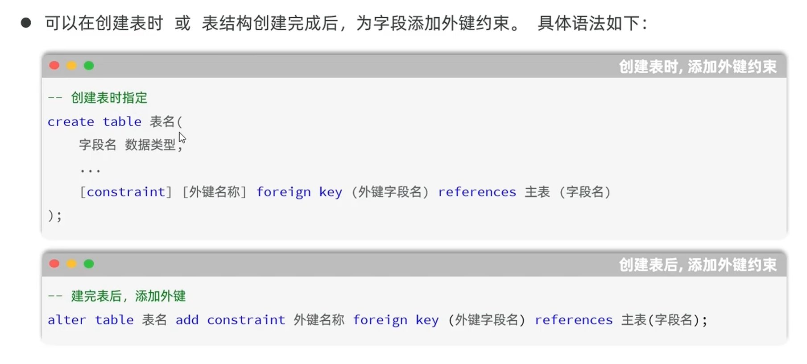

# 一对多

一对多的关系，只需要在多的那一方添加一个键，这个键就是属于一这个关系的主键

```
create table dept(
    id int unsigned primary key auto_increment comment 'ID',
    name varchar(10) not null unique comment '部门名称',
    create_time datetime comment '创建时间',
    update_time datetime comment '修改时间'
) comment '部门表';

create table emp(
    id int unsigned primary key auto_increment comment 'ID,主键',
    username varchar(20) not null unique comment '用户名',
    password varchar(32) not null comment '密码',
    name varchar(10) not null comment '姓名',
    gender tinyint unsigned not null comment '性别，1:男，2:女',
    phone char(11) not null unique comment '手机号',
    job tinyint unsigned comment '职位，1:班主任,2:讲师...',
    salary int unsigned comment '薪资',
    image varchar(255) comment '头像',
    entry_date date comment '入职日期',
    create_time datetime comment '创建时间',
    update_time datetime comment '修改时间'
) comment '员工表';
```


### 我们要在多的这个表中添加外键约束，要不然就没有任何关联



### 要是想添加外键，必须要在子表中有对应的字段，要不然就会添加失败

```
alter table emp add constraint fk_emp_dept_id foreign key (dept_id) references dept(id);
```

`alter table emp`：要修改的子表（员工表）

`add constraint fk_emp_dept_id`：新增外键约束，自定义约束名

`foreign key (dept_id)`：当前 emp 表中作为外键的字段

1. `references dept(id)`：关联的主表 dept 的主键 id


## 数据库中的外键约束的作用

### 多表查询时候保持数据的一致性，完整性和正确性


## 物理外键和逻辑外键的选择？

### 逻辑外键